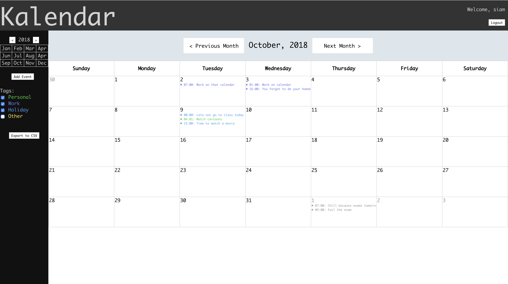

## Kalendar
<!-- ## CSE 330 Module 5 (Group) -->

**Siam Abd Al-Ilah  
Animan Amit**

See the project [here](http://ec2-52-15-37-3.us-east-2.compute.amazonaws.com/~siamabdalilah/calendar/calendar.html)

A calendar webapp made with JavaScript and PHP. The communication with the back end is done with AJAX requests and uses MySQL for the database. Users can register add/edit/delete events and separate them in categorized them with four different tags. Logged in users can click on cells and view event details or add events on that date. Users can also export selected categories to a CSV file which can be imported into Google Calendar.

<!-- ### Creative portion involves:
* Being able to separate events into 4 different tags.  
* Year view navigation on the side bar to enable   faster switching between months and years.  
* Adding event after selecting a cell would prefill the add event with specified date.  
* Overflow in each cell is handled by enabling scroll.  
* Export events from selected tags of calendar to a well formatted CSV file which can then be imported to Google Calendar. So you get all features of google calendar. Ples giv xtra crdzs

### Note on page validation
The HTML page does not validate because of having empty <tr> tags in the file. We decided to have it that way because the number of rows can change depending on the month and removing and adding tr tags each time would seemed to unnecessarily complicate the logic. The empty tr tags have no effect on the visual.  

Another warning we get is for using date and time type inputs, which the validator says might not work on all browsers. We checked the latest versions of Chrome and Firefox and it works fine.

Sample User with preloaded events:
Username: testing
Password: testing

Note: The table cells scroll in case of overflow. The cells are not clickable until a user is logged in. Clicking will not work when the text selector cursor is visible. -->
